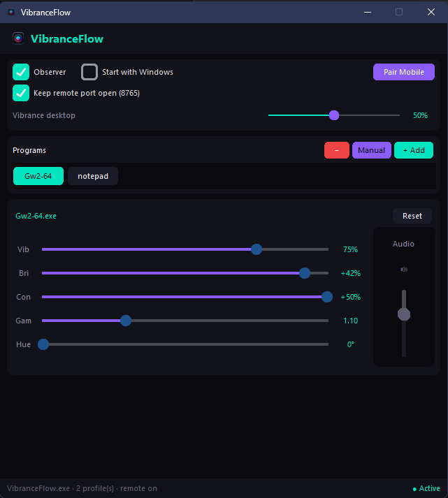
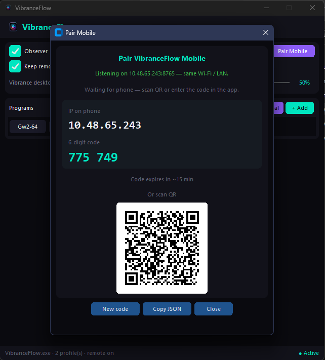

# VibranceFlow Core

[](LICENSE)
[](https://github.com/VibranceFlow/VibranceFlow-core/actions/workflows/build-windows.yml)

VibranceFlow Core is the Windows desktop app for game-based color profiles and local mobile pairing.

## Release 1.1 scope

- Supported desktop platform: **Windows 11**
- Public build format: **single-file `.exe`** (~22 MB, Nuitka LTO)
- Mobile companion: **Android APK** (5 builds per release - see [VibranceFlow-mobile](https://github.com/VibranceFlow/VibranceFlow-mobile/releases))

## Who is this for? (Use Cases)

VibranceFlow is fully standalone on Windows. The optional mobile companion acts as a convenient remote control.

- **🎮 Gamers:** Adjust contrast and gamma *in-game*. Control the volume of background music (Spotify, Discord, etc.) directly from your phone without ever needing to Alt-Tab.
- **🎨 Designers & Editors:** Easily alter saturation (vibrance) and contrast to test the visual accessibility of images, drawings, and videos across different spectrums.
- **📺 Casual Users:** Control your PC's screen brightness, color tone, and volume remotely from the couch using your phone as a multimedia remote.
- **🎥 Streamers:** Dynamically switch screen color profiles on your main display without leaking settings on the stream or interrupting the broadcast.

### App Preview

<p align="center">
  
  
</p>

## Download and install (Windows)

Official downloads live on GitHub Releases:

| Build | Latest (v1.1.0) | All releases |
| --- | --- | --- |
| **Windows** (`VibranceFlow.exe`) | [Download](https://github.com/VibranceFlow/VibranceFlow-core/releases/download/V1.1.0/VibranceFlow.exe) · [SHA-256](https://github.com/VibranceFlow/VibranceFlow-core/releases/download/V1.1.0/VibranceFlow.exe.sha256) | [Releases](https://github.com/VibranceFlow/VibranceFlow-core/releases) |
| **Android** (`vibranceflow-universal-release.apk`) | [Download](https://github.com/VibranceFlow/VibranceFlow-mobile/releases/download/V1.1.0/vibranceflow-universal-release.apk) · [SHA-256](https://github.com/VibranceFlow/VibranceFlow-mobile/releases/download/V1.1.0/vibranceflow-universal-release.apk.sha256) | [Releases](https://github.com/VibranceFlow/VibranceFlow-mobile/releases) |

Steps on Windows:

1. Open **[VibranceFlow Core Releases](https://github.com/VibranceFlow/VibranceFlow-core/releases)**.
2. Download the latest `VibranceFlow.exe` (and optionally `VibranceFlow.exe.sha256`) from that release.
3. Place it in any folder (for example `C:\Program Files\VibranceFlow\`).
4. Run `VibranceFlow.exe`.

If Windows SmartScreen appears, choose **More info** and continue **only** after verifying the SHA256 hash matches the official release. Unsigned builds show an unknown publisher - that is expected until a commercial code-signing certificate is funded.

## First run

1. Open VibranceFlow.
2. Add a game executable from the process list or manually from disk.
3. Configure sliders (Vibrance, Brightness, Contrast, Gamma, Hue).
4. Optional: configure per-app audio when a live audio session exists.
5. Open **Pair Mobile** to connect your Android phone over LAN.

## Firewall and LAN pairing

Mobile control uses a local WebSocket on port `8765` (same Wi‑Fi / LAN as the PC).

1. Open **Pair Mobile** in the desktop app.
2. If a firewall warning appears, click **Allow in Firewall** and approve the Windows UAC prompt once.
   This adds an inbound rule for TCP `8765` on **private** networks only.
3. On the phone, enter the shown **IP + 6-digit code**, or scan the **QR code** (recommended).

You do **not** need to run VibranceFlow as administrator. Only the one-time firewall approval requires elevation.

Optional setting **Keep remote port open (8765)** stays enabled after Pair Mobile so the phone can reconnect later. Uncheck it to stop the LAN server when no phone is connected.

All commands are encrypted on the LAN using Fernet payload encryption.

## Privacy and security

- No cloud account is required.
- No telemetry backend is required for normal use.
- Pairing keys stay local and can be rotated from the Pair Mobile dialog.

Threat model and reporting: [SECURITY.md](SECURITY.md). Wire protocol (contributors): [docs/REMOTE_PROTOCOL.md](docs/REMOTE_PROTOCOL.md).

## 🛡️ Security, False Positives & Transparency

VibranceFlow Core is packaged with **Nuitka** (Python to native code) as a Windows executable. The default public build is a **single-file `.exe`** (`--onefile`), which unpacks to a temporary folder on first launch - a common pattern that some antivirus heuristics flag on unsigned software.

At runtime, the app calls native Windows APIs (**Win32/NVAPI**) to apply display settings, may open a **LAN WebSocket** for optional mobile control, and can request a **one-time UAC prompt** to add a private-network firewall rule for pairing. These behaviors are required for the product and are documented in the open-source tree.

Because the executable is currently distributed **without a paid EV/OV code-signing certificate**, heuristic and ML-based engines (including SmartScreen and some antivirus models) may classify it as unknown or suspicious by default, even when no malicious behavior exists.

This project follows a strict transparency model:

- 100% open-source codebase
- LAN-only communication model
- encrypted local transport (WebSocket + payload encryption)
- zero analytics and zero telemetry
- every release publishes `VibranceFlow.exe.sha256` for integrity verification

Transparency - VirusTotal reports (v1.1.0, CI-built artifacts):

- **Windows** (`VibranceFlow.exe`): [VirusTotal](https://www.virustotal.com/gui/file/de47071336775b4b8486b02e35be3b6583701d3a31a2f04d29cdc9fe2e95a960?nocache=1) · SHA-256 `de47071336775b4b8486b02e35be3b6583701d3a31a2f04d29cdc9fe2e95a960`
- **Android** (5 APKs + checksum sidecars): see [VibranceFlow-mobile Releases](https://github.com/VibranceFlow/VibranceFlow-mobile/releases/tag/V1.1.0) and [mobile README](https://github.com/VibranceFlow/VibranceFlow-mobile#-security-false-positives--transparency)

Before trusting any downloaded executable, always verify integrity:

1. Download `VibranceFlow.exe` and `VibranceFlow.exe.sha256` from the **same** release.
2. In PowerShell:

```powershell
Get-FileHash ".\VibranceFlow.exe" -Algorithm SHA256
```

3. Confirm the hash matches the value in `VibranceFlow.exe.sha256`.

If Microsoft Defender or another engine flags the binary:

1. Verify you downloaded from the official release and the hash matches.
2. Submit a false-positive report to [Microsoft Security Intelligence](https://www.microsoft.com/en-us/wdsi/filesubmission).
3. Submit the same sample to the vendor that flagged it (see the runbook for vendor links).
4. Re-check detections after signature/model refresh cycles (usually 24–72 hours).

Do **not** disable your antivirus. Restore the file from the official release after verifying the hash, or wait for vendor false-positive clearance.

## ☕ Support the Project

Modern software distribution has real platform tolls that are difficult for independent open-source projects:

- Windows code-signing certificates (OV/EV): **US$80+/year**
- Apple Developer Program: **US$99/year**
- Google Play Store registration: **US$25** one-time

Support link: [Support VibranceFlow on Ko-fi](https://ko-fi.com/fabio_monreal)

If community funding reaches these milestones, VibranceFlow binaries can be signed and published through official stores/channels (Microsoft, Apple, Google).  
Until then, the focus remains: open-source, free access, transparent security practices, and reproducible local tooling.

## Troubleshooting

- **Mobile cannot connect:** same Wi‑Fi / LAN; use **Allow in Firewall** in Pair Mobile; confirm the IP shown is not `127.0.0.1`. Turn off mobile data on the phone (4G cannot reach `192.168.x.x`).
- **Old Android APK fails but Expo Go works:** install a current APK built with LAN cleartext config - see [mobile compatibility notes](https://github.com/VibranceFlow/VibranceFlow-mobile/blob/main/docs/CORE_APK_COMPATIBILITY.md).
- **Port already in use:** close any other VibranceFlow window (only one instance can run).
- **`.exe` does not open:** try the debug build (`packaging/build_windows_debug.ps1`) or check `%APPDATA%\VibranceFlow\app.log`.
- **Defender removed or quarantined the `.exe`:** open Windows Security → Protection history; if the file was removed, download again from the official [GitHub Release](https://github.com/VibranceFlow/VibranceFlow-core/releases), verify SHA256, then run. If it is blocked again, submit a false positive to [Microsoft Security Intelligence](https://www.microsoft.com/en-us/wdsi/filesubmission) (see [docs/FALSE_POSITIVE_RUNBOOK.md](docs/FALSE_POSITIVE_RUNBOOK.md)).
- **SmartScreen "Windows protected your PC":** click **More info** → **Run anyway** only after SHA256 verification against the official release. Unknown publisher is expected for unsigned builds.
- **Audio slider is disabled:** the selected app has no active audio session on the PC.
- **Profile not switching:** verify Observer is enabled and the executable is saved in the profile list.

## Mobile companion (protocol v1)

Core releases on **protocol v1** (port `8765`, Fernet wire) stay compatible with **VibranceFlow-mobile** APK **1.1.x** (or any 1.x build with LAN cleartext). You do **not** need a new APK for core-only GUI, engine, firewall, or packaging updates.

Coordinate a **new APK** only when bumping wire `"v"`, port, Fernet format, or mobile pairing code. Full matrix: [VibranceFlow-mobile/docs/CORE_APK_COMPATIBILITY.md](https://github.com/VibranceFlow/VibranceFlow-mobile/blob/main/docs/CORE_APK_COMPATIBILITY.md).

## For developers

Development setup, packaging notes, and contribution rules are documented in [CONTRIBUTING.md](CONTRIBUTING.md) and [packaging/README.md](packaging/README.md).

## License

GPL-3.0 - see [LICENSE](LICENSE).
